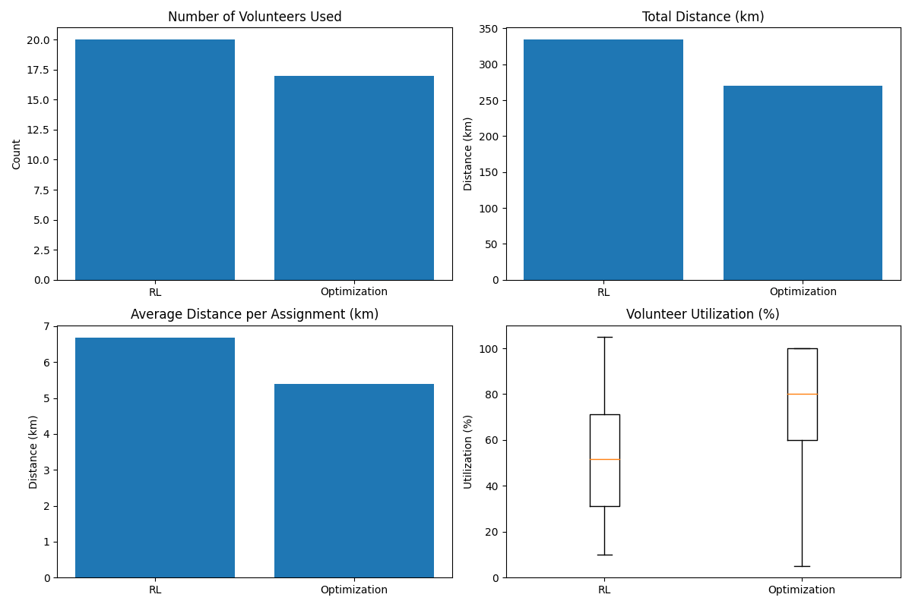

# Volunteer Assignment Optimization System

## Project Overview

This project provides an end-to-end solution for automating and optimizing the monthly assignment of volunteers to recipients for box deliveries, with integrated pickup locations. The system has evolved from an initial Reinforcement Learning (RL) approach to a robust, scalable optimization-based method using Google OR-Tools. Both approaches are included for benchmarking, educational value, and transparency.

### Why Two Approaches?
- **Optimization Approach (Current, Preferred):**
  - Uses Mixed-Integer Programming (MIP) via Google OR-Tools for globally optimal, deterministic assignments.
  - Handles complex constraints (vehicle capacity, proximity, clustering, historical preferences, pickup locations) efficiently and transparently.
  - Significantly outperforms RL in solution quality, speed, and maintainability for this use case.
- **Reinforcement Learning (Legacy, Benchmark):**
  - Actor-Critic RL agent learns assignment policies over time.
  - Useful for research, experimentation, and understanding sequential decision-making.
  - Retained for comparison and educational purposes.

### When to Use Each Approach?
- **Use Optimization** for production, real-world assignments, or when you need the best possible solution.
- **Use RL** for experimentation, learning, or if you want to explore AI-based assignment strategies.

---

## Problem Statement

Assign volunteers (with vehicle capacity limits and home locations) to recipients (with box requirements and geographic coordinates) such that:
- All recipients are assigned
- Volunteer travel is minimized
- Vehicle capacity is not exceeded
- Historical and admin preferences are respected
- Geographic clustering is leveraged for efficiency

---

## System Architecture

- **Optimization Solver:**
  - Formulates the assignment as a MIP using Google OR-Tools
  - Constraints: Each recipient assigned once, volunteer capacity, cluster cohesion, historical scores
  - Objective: Minimize total distance, number of volunteers, and maximize preference/cluster bonuses

- **RL Pipeline:**
  - Custom Gym environment simulates assignment process
  - Actor-Critic agent learns to assign volunteers to recipients
  - Reward function encodes efficiency, proximity, capacity, and clustering

- **Visualization & Reporting:**
  - Folium maps, load distribution charts, and detailed markdown reports
  - Comparison tools to benchmark RL vs. optimization

---

## Data Source

- **Database:** MySQL (accessed via SQLAlchemy)
- **Key Tables:**
  - `volunteer`: volunteer_id, zip_code, car_size
  - `recipient`: recipient_id, latitude, longitude, num_items
  - `delivery_archive`: volunteer_id, recipient_id, timestamp

---

## How to Use

1. **Install dependencies** (Python 3.10+ recommended):
   ```bash
   python3.10 -m venv venv
   source venv/bin/activate
   pip install -r requirements.txt
   ```
2. **Initialize the database:**
   ```bash
   python main.py init-db
   ```
3. **Run the optimization pipeline:**
   ```bash
   python main.py pipeline-opt
   ```
4. **(Optional) Run the RL pipeline:**
   ```bash
   python main.py pipeline-rl
   ```
5. **Compare both approaches:**
   ```bash
   python main.py compare
   ```
6. **View outputs:**
   - Interactive maps and comparison graphs in `output/`
   - (Optional) Assignments CSVs and reports can be exported, but are not required for testing. Temporary CSVs used for comparison are deleted after use.

---

## Project Structure

```bash
AID-OS/
├── assignment/                  # Volunteer assignment logic
│   ├── assign_volunteers.py         # RL-based assignment
│   └── assign_volunteers_opt.py     # Optimization-based assignment using Google OR-Tools 
├── clustering/                  # Recipient clustering
│   └── dbscan_cluster.py            # HDBSCAN clustering implementation
├── data/                        # Data access and config
│   ├── db_config.py                  # MySQL/DB connection config
│   └── migrations/                    # (If present) DB migration scripts
├── env/                         # RL environment
│   └── delivery_env.py               # Custom Gym environment for RL
├── feedback/                    # Admin/user feedback
│   └── feedback_handler.py           # Feedback processing
├── models/                      # RL agent models
│   ├── actor.py                      # Actor network
│   ├── critic.py                     # Critic network
│   └── rl_agent.py                   # RL agent logic
├── output/                      # Outputs (assignments, reports, maps)
├── training/                    # RL training scripts
│   └── train_agent.py                # RL agent training loop
├── main.py                      # CLI entry point
├── requirements.txt             # Python dependencies
└── README.md                    # Project documentation
```

---

## Achievements
- **Deterministic, optimal assignments** using mathematical optimization
- **Legacy RL agent** for research and benchmarking
- **Interactive visualizations** and detailed reporting
- **Comprehensive comparison tools** for evaluating methods
- **Scalable, maintainable codebase** ready for real-world deployment

---

## RL vs. Optimization: Visual Comparison


*Comparison of assignment results between the RL and Optimization approaches. This image highlights differences in volunteer assignment efficiency, travel distance, and load distribution.*

---

## Future Directions
- **Advanced route optimization** (TSP, time windows)
- **Fairness & diversity metrics** for volunteer load balancing
- **Multi-city scaling**
- **Automated hyperparameter tuning**
- **User/admin web dashboard**

---

## Rationale for Including RL

While the optimization approach is now the primary method, the RL pipeline remains for:
- **Educational value:** Demonstrates how RL can be applied to combinatorial assignment problems
- **Benchmarking:** Quantitative comparison of AI vs. mathematical programming
- **Research:** Platform for experimenting with new RL reward functions, state/action spaces, or hybrid approaches

---

## Contact
For questions or collaborations, open an issue or contact the project lead via this repository.

---

## Problem Type

- **Reinforcement Learning (RL)** modeled as a **Markov Decision Process (MDP)**
- **Episodic MDP:** One episode represents a single monthly assignment cycle
- **Objective:** Maximize overall assignment efficiency and quality over the episode

---

## MDP Components

### State (S)
Each state is represented by a feature vector that includes:
- **Volunteer Information:**  
  - Volunteer ID 
  - Volunteer location (converted from zip code to coordinates)  
  - Car capacity (number of boxes the volunteer can carry)  
  - Current load (boxes already assigned)
  - Historical match score (past assignments)

- **Recipient Information:**  
  - Recipient ID  
  - Recipient coordinates (latitude, longitude)  
  - Number of boxes required

- **Contextual Information:**  
  - Current pool of unassigned recipients  
  - Cluster information for recipients (derived from HDBSCAN clustering)  
  - Counts of recipients within each cluster  
  - Any additional admin or preference signals

### Action (A)
An action is a decision to assign a volunteer to a recipient or to a recipient cluster:
- **Direct Pairing:** `assign(volunteer_id, recipient_id)`
- **Cluster-Based Assignment:** `assign(volunteer_id, recipient_cluster)`

*For this project, we adopt the action formulation that best suits the scale and geographic complexity. In our implementation, we use a direct pairing assignment strategy.*

### Reward (R)
The reward function is defined to encourage optimal assignments, with configurable weights for each component:

- **Volunteer Efficiency:** 
  - +1.0 for selecting the optimal volunteer for a recipient
  - -1.0 to -4.0 penalties for selecting a suboptimal volunteer when better options exist

- **Proximity Rewards:**
  - Exponential decay based on distance (max +2.0)
  - +5.0 for recipients less than 2km apart
  - +2.0 for moderate distances (2-5km)
  - -3.0 * (distance/5.0) penalty for recipients more than 5km apart

- **Directional Consistency:**
  - +4.0 for recipients in similar directions (<30° difference)
  - +2.0 for recipients in moderately similar directions (30-45°)
  - -2.0 penalty for significantly different directions (90-120°)
  - -5.0 severe penalty for opposite directions (>120°)

- **Capacity Utilization:**
  - +3.0 for optimal capacity usage (90-115%)
  - +1.0 for good utilization (80-90%)
  - +0.5 for moderate utilization (70-80%)
  - -4.0 penalty for overloading (>115%)

- **Cluster Membership:**
  - +1.0 for keeping recipients from the same cluster with the same volunteer
  - -2.0 penalty for splitting clusters across volunteers with low utilization

- **Travel Time Efficiency:**
  - -2.5 points per hour of estimated travel time
  - Includes route optimization and delivery time estimation

### Episode
An episode is defined as one complete monthly assignment cycle. The episode ends when every recipient has been assigned to a volunteer.

---

## Data Source

All data is stored in a **MySQL** database accessed via phpMyAdmin. The key tables are:
- `volunteer`: Contains `volunteer_id`, `zip_code`, `car_size`
- `recipient`: Contains `recipient_id`, `latitude`, `longitude`, `num_items`
- `delivery_archive`: Contains `volunteer_id`, `recipient_id`, `timestamp` (historical data for the past two months)

Data is extracted via SQL queries using a suitable Python connector, SQLAlchemy.

---

## Implementation Details

### 1. Data Ingestion and Feature Engineering
- MySQL database connection using SQLAlchemy
- Haversine distance calculation for accurate distance measurement
- DBSCAN clustering for geographic grouping of recipients
- Historical match score retrieval and decay based on recency

### 2. Environment Design
- Custom Gym-compatible environment (DeliveryEnv)
- State representation with volunteer and recipient features
- Action space as volunteer-recipient pairings
- Sophisticated reward function with weighted components

### 3. RL Algorithm: Proximal Policy Optimization (PPO)
- **Actor:** Policy network that selects the best volunteer-recipient pairing
- **Critic:** Value network that estimates expected returns
- Clipped surrogate objective to prevent policy collapse
- Entropy bonus for exploration
- Generalized Advantage Estimation (GAE) for stable learning
- Configurable hyperparameters:
  - `clip_epsilon=0.2`
  - `value_loss_coef=0.5`
  - `entropy_coef=0.01`

### 4. Route Optimization
- Greedy nearest-neighbor algorithm for route planning
- Travel time estimation based on distance and number of stops
- Directional consistency evaluation to minimize backtracking
- Round-trip calculation (volunteer home → recipients → home)

### 5. Visualization and Reporting
- Interactive map visualization with Folium
  - Pickup locations are shown with a marker displaying both available items and the total number of boxes needed (demand) at each site.
  - Volunteer, pickup, and recipient routes are visualized, showing the full delivery path.
- Detailed popup information including:
  - Volunteer capacity and utilization
  - Assigned recipients and box counts
  - Pickup location demand (boxes needed at each pickup)
  - Estimated travel time and distance
- Load distribution charts
- Comprehensive assignment reports

---

## Technology Stack

- **Programming Language:** Python 3.8+
- **Database:** MySQL (accessed via SQLAlchemy)
- **RL Framework:** Custom implementation using PyTorch
- **Environment Simulation:** Custom Gym-compatible environment
- **Data Processing:** Pandas, NumPy
- **Clustering:** Scikit-learn (HDBSCAN)
- **Visualization:** Matplotlib, Folium, Seaborn
- **Geospatial Calculations:** Haversine formula for accurate distances

---

## Project Structure


```bash
AID-RL/
├── data/
│   └── db_config.py           # MySQL connection configuration using SQLAlchemy
│
├── models/
│   ├── actor.py               # Defines the policy network (Actor)
│   ├── critic.py              # Defines the value estimator (Critic)
│   └── rl_agent.py            # The Actor-Critic agent class
│
├── clustering/
│   └── dbscan_cluster.py      # DBSCAN-based recipient clustering
│
├── env/
│   └── delivery_env.py        # Custom RL environment for volunteer-recipient assignment
│
├── training/
│   └── train_agent.py         # Training loop for RL agent
│
├── feedback/
│   └── feedback_handler.py    # Collects and processes admin feedback
│
├── assignment/
│   └── assign_volunteers.py   # Outputs optimal volunteer-to-recipient assignments
│
└── README.md                  # Project overview
```

---

## ✅ Achievements

- **Automated Assignment System:** Complete end-to-end pipeline from data to assignments
- **Optimized Routes:** Minimized travel time and distance with directional consistency
- **Efficient Capacity Utilization:** Balanced assignments to maximize vehicle usage
- **Intelligent Clustering:** Grouped nearby recipients for efficient delivery
- **Travel Time Estimation:** Accurate prediction of route completion times
- **Interactive Visualization:** Detailed maps showing assignments and metrics
- **Comprehensive Reporting:** Detailed assignment statistics and performance metrics

---

## ✨ Future Features

- **Advanced Route Optimization:** Implement full Traveling Salesman Problem (TSP) solution
- **Recipient Time Windows:** Support for preferred delivery time slots
- **Fairness Metrics:** Balance volunteer usage over time
- **Multi-City Scaling:** Support for multiple geographic regions
- **Hyperparameter Optimization:** Automated tuning of reward weights

---

## 📬 Contact

For any questions or collaborations, reach out via this repo or project lead.

